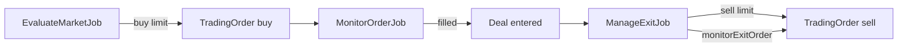

# Trading Architecture

ربات تریدینگ Wallex با Laravel Queue و سه حلقه اصلی کار می‌کند.

## جریان کلی



## مدل‌ها

| مدل | جدول | نقش |
|-----|------|-----|
| `Market` | `markets` | نماد معاملاتی فعال |
| `TradingOrder` | `orders` | اردر buy یا sell |
| `Deal` | `deals` | چرخه عمر معامله (opening → entered → exiting → closed) |
| `Trade` | `trades` | fill ثبت‌شده روی اردر |

## Scopes روی `TradingOrder`

| Scope | فیلتر | کاربرد |
|-------|--------|--------|
| `entry()` | `side = buy` | ورود به معامله |
| `exit()` | `side = sell` | خروج از معامله |
| `active()` | `pending`, `open`, `partially_filled` | اردرهای باز |
| `monitorable()` | active **یا** buy پر شده بدون trade | کاندید `MonitorOrderJob` (باید با `entry()` ترکیب شود) |

## سرویس‌ها

| سرویس | مسئولیت |
|--------|---------|
| `MarketEvaluationService` | ارزیابی فرصت entry و ثبت buy |
| `OrderMonitoringService` | polling وضعیت buy، cancel در صورت از بین رفتن فرصت |
| `ExitManagementService` | مدیریت sell: repricing، stop-loss، `monitorExitOrder` |
| `TradeRecorder` | ثبت fill و به‌روزرسانی deal |
| `ExpireOpeningDealsService` | انقضای dealهای opening بدون fill |

## تنظیمات

- `config/trading.php` — پیش‌فرض‌ها
- `TradingSettingsService` + جدول `trading_settings` — runtime toggles
- Filament: `TradingSettings` page

## فایل‌های کلیدی

```
app/Domain/Trading/Services/
app/Jobs/Trading/
app/Console/Commands/DispatchTradingJobs.php
routes/console.php
app/Models/TradingOrder.php
```
