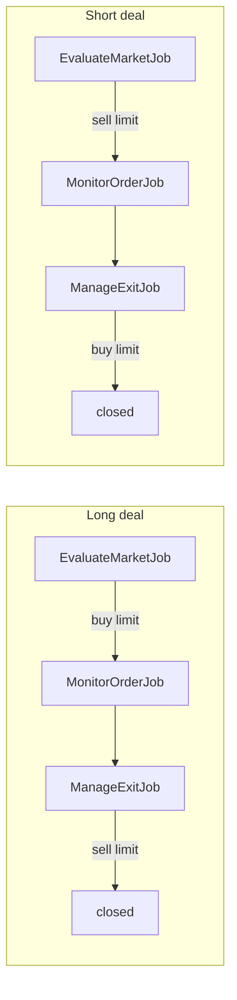

# Trading Architecture

ربات تریدینگ Wallex با Laravel Queue و سه حلقه اصلی کار می‌کند.

## جریان کلی



## Deal direction

| `direction` | Entry leg | Exit leg |
|-------------|-----------|----------|
| `long` (پیش‌فرض) | buy | sell |
| `short` | sell | buy |

فعال‌سازی per-market: `markets.long_enabled`, `markets.short_enabled`.

## مدل‌ها

| مدل | جدول | نقش |
|-----|------|-----|
| `Market` | `markets` | نماد معاملاتی فعال + فلگ long/short |
| `TradingOrder` | `orders` | اردر buy یا sell |
| `Deal` | `deals` | چرخه عمر معامله + `direction` |
| `Trade` | `trades` | fill ثبت‌شده روی اردر |

## Scopes روی `TradingOrder`

| Scope | فیلتر | کاربرد |
|-------|--------|--------|
| `entry()` | `side = buy` | side خام اکسچنج (legacy) |
| `exit()` | `side = sell` | side خام اکسچنج (legacy) |
| `entryLeg()` | buy برای long، sell برای short | dispatch `MonitorOrderJob` |
| `active()` | `pending`, `open`, `partially_filled` | اردرهای باز |
| `monitorable()` | active **یا** entry-leg پر شده بدون trade | کاندید `MonitorOrderJob` (با `entryLeg()`) |

در context یک deal از `Deal::entrySide()` / `exitSide()` استفاده کنید.

## سرویس‌ها

| سرویس | مسئولیت |
|--------|---------|
| `MarketEvaluationService` | ارزیابی فرصت entry (long و short) |
| `OrderMonitoringService` | polling leg ورود، cancel در صورت از بین رفتن فرصت |
| `ExitManagementService` | مدیریت leg خروج: repricing، stop-loss |
| `TradeRecorder` | ثبت fill و PnL direction-aware |
| `ExpireOpeningDealsService` | انقضای dealهای opening بدون fill |

## تنظیمات

- `config/trading.php` — پیش‌فرض‌ها
- `TradingSettingsService` + جدول `trading_settings` — runtime toggles
- Filament: `TradingSettings` page

## فایل‌های کلیدی

```
app/Domain/Trading/Services/
app/Jobs/Trading/
app/Console/Commands/DispatchTradingJobs.php
routes/console.php
app/Models/TradingOrder.php
app/Models/Deal.php
```
